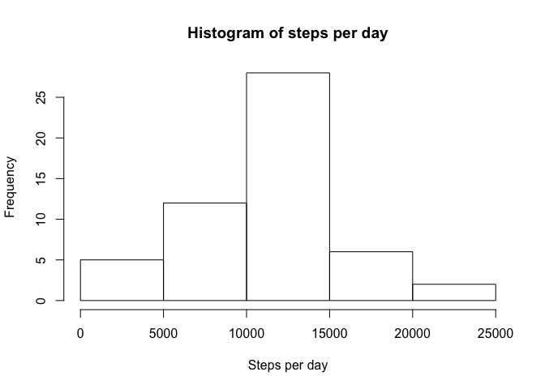
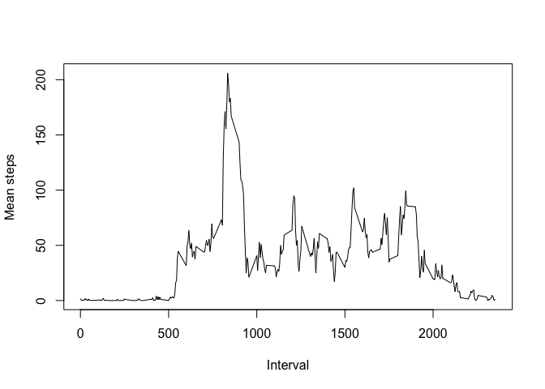
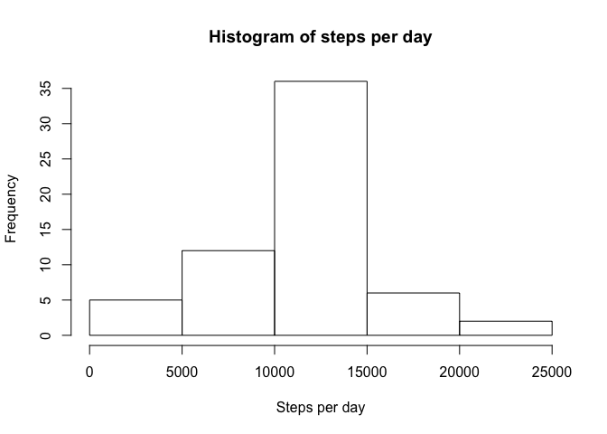
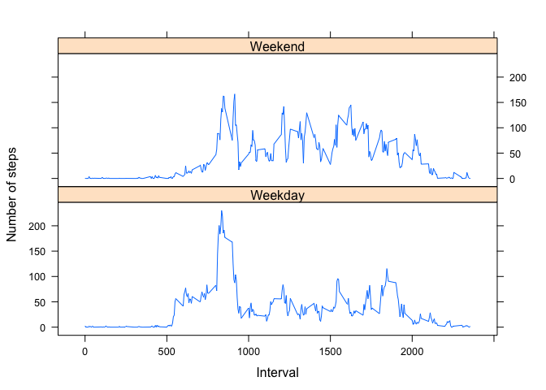

# Reproducible Research: Peer Assessment 1

## Loading and preprocessing the data


```r
# read frmom csv file in working directory
data <- read.csv("activity.csv")

# re-format dates
data$date <- as.Date(data$date, "%Y-%m-%d")
data$date <- strftime(data$date, "%d-%m-%Y")
head(data)
```

```
##   steps       date interval
## 1    NA 01-10-2012        0
## 2    NA 01-10-2012        5
## 3    NA 01-10-2012       10
## 4    NA 01-10-2012       15
## 5    NA 01-10-2012       20
## 6    NA 01-10-2012       25
```

## What is mean total number of steps taken per day?

Calculate the total number of steps taken per day:

```r
library(plyr)
daily_totals <- ddply(data[,1:2], .(date), colwise(sum))
head(daily_totals)
```

```
##         date steps
## 1 01-10-2012    NA
## 2 01-11-2012    NA
## 3 02-10-2012   126
## 4 02-11-2012 10600
## 5 03-10-2012 11352
## 6 03-11-2012 10571
```

Make a histogram of the total number of steps taken each day:

```r
hist(daily_totals$steps, main="Histogram of steps per day", xlab="Steps per day")
```

<!-- -->

Calculate and report the mean and median of the total number of steps taken per day:


```r
mean_steps <- mean(daily_totals$steps, na.rm = TRUE)
mean_steps
```

```
## [1] 10766.19
```

```r
median_steps <- median(daily_totals$steps, na.rm = TRUE)
median_steps
```

```
## [1] 10765
```

## What is the average daily activity pattern?

Make a time series plot (i.e. 𝚝𝚢𝚙𝚎 = "𝚕") of the 5-minute interval (x-axis) and the average number of steps taken, averaged across all days (y-axis).


```r
# calculate mean steps per interval
interval_means <- ddply(data, ~interval, summarise, mean_steps=mean(steps, na.rm=TRUE))
head(interval_means)
```

```
##   interval mean_steps
## 1        0  1.7169811
## 2        5  0.3396226
## 3       10  0.1320755
## 4       15  0.1509434
## 5       20  0.0754717
## 6       25  2.0943396
```

```r
# plot average steps throughout the day
plot(interval_means$interval, interval_means$mean_steps, type = "l", xlab = "Interval", ylab = "Mean steps")
```

<!-- -->

Which 5-minute interval, on average across all the days in the dataset, contains the maximum number of steps?


```r
interval_means[which.max(interval_means$mean_steps),]
```

```
##     interval mean_steps
## 104      835   206.1698
```

## Imputing missing values
Calculate and report the total number of missing values in the dataset (i.e. the total number of rows with 𝙽𝙰s)

Create a new dataset that is equal to the original dataset but with the missing data filled in.

```r
# replace NA values with mean steps for that interval across all days
data$steps[is.na(data$steps)] <- interval_means$mean_steps[match(data$interval[is.na(data$steps)],interval_means$interval)]
```

Make a histogram of the total number of steps taken each day:

```r
# re-calculate the daily totals
daily_totals <- ddply(data[,1:2], .(date), colwise(sum))
head(daily_totals)
```

```
##         date    steps
## 1 01-10-2012 10766.19
## 2 01-11-2012 10766.19
## 3 02-10-2012   126.00
## 4 02-11-2012 10600.00
## 5 03-10-2012 11352.00
## 6 03-11-2012 10571.00
```

```r
# show in a histogram
hist(daily_totals$steps, main="Histogram of steps per day", xlab="Steps per day")
```

<!-- -->

Calculate and report the mean and median total number of steps taken per day:

```r
mean_steps <- mean(daily_totals$steps, na.rm = TRUE)
mean_steps
```

```
## [1] 10766.19
```

```r
median_steps <- median(daily_totals$steps, na.rm = TRUE)
median_steps
```

```
## [1] 10766.19
```

Do these values differ from the estimates from the first part of the assignment?  
*The  median has changed, but the mean has stayed the same.*

What is the impact of imputing missing data on the estimates of the total daily number of steps?  
*No impact.*

## Are there differences in activity patterns between weekdays and weekends?

Create a new factor variable in the dataset with two levels – “weekday” and “weekend” indicating whether a given date is a weekday or weekend day.


```r
# get days of the week
data$date <- as.Date(data$date, "%d-%m-%Y")
data$day <- weekdays(data$date)

# replace day of the week with ether “weekday” or “weekend”
data$day <- sub("(Monday|Tuesday|Wednesday|Thursday|Friday)", "Weekday", data$day)
data$day <- sub("(Saturday|Sunday)", "Weekend", data$day)
data$day <- as.factor(data$day)
```

Make a panel plot containing a time series plot (i.e. 𝚝𝚢𝚙𝚎 = "𝚕") of the 5-minute interval (x-axis) and the average number of steps taken, averaged across all weekday days or weekend days (y-axis).


```r
# calculate average interval steps on weekends and weekdays
library(dplyr)
```

```
## Warning: Installed Rcpp (0.12.10) different from Rcpp used to build dplyr (0.12.11).
## Please reinstall dplyr to avoid random crashes or undefined behavior.
```

```
## 
## Attaching package: 'dplyr'
```

```
## The following objects are masked from 'package:plyr':
## 
##     arrange, count, desc, failwith, id, mutate, rename, summarise,
##     summarize
```

```
## The following objects are masked from 'package:stats':
## 
##     filter, lag
```

```
## The following objects are masked from 'package:base':
## 
##     intersect, setdiff, setequal, union
```

```r
day_interval_means <- data %>% group_by(day, interval) %>% 
    summarise(mean_steps = mean(steps))

# plot line graph on two panels
library(lattice)
xyplot(mean_steps ~ interval|day, 
    data = day_interval_means,
    type = "l",
    xlab = "Interval",
    ylab = "Number of steps",
    layout=c(1,2))
```

<!-- -->

